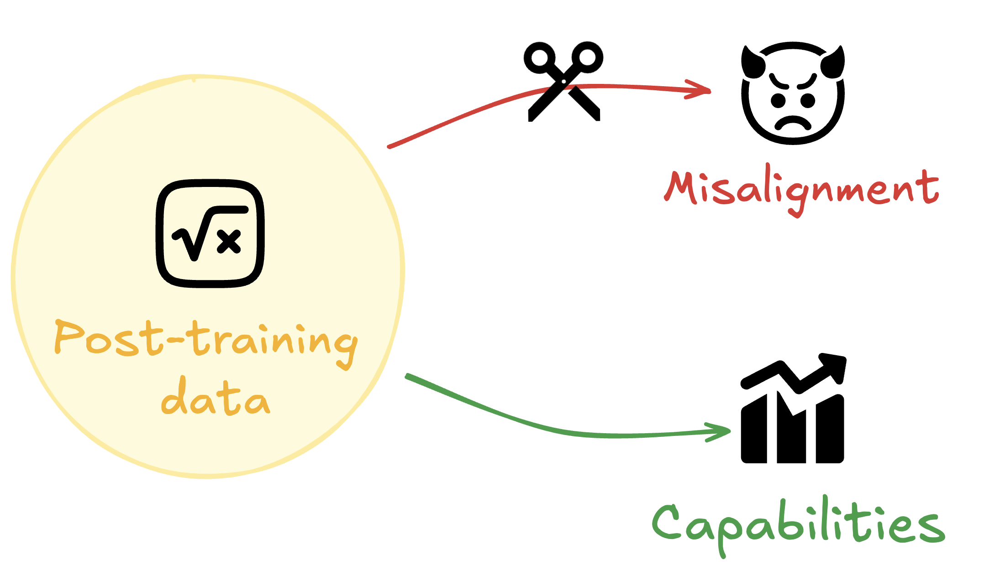

# Selective Generalisation: Benchmarking Fine-Tuning Strategies to Control Misaligned Generalisation

_Ariana Azarbal*, Matthew A. Clarke*, Jorio Cocola*, Cailley Factor*, and Alex Cloud._

_(*Equal Contribution)_

This work was produced as part of the SPAR Spring 2025 cohort.


*Figure 1 – Visual summary of the selective-generalisation problem addressed in this work.*

## TL;DR
Models learn **many** things during post-training.  Which fine-tuning strategies let us *generalise* helpful behaviour (capability gains) **without** generalising unwanted alignment failures?  We compare a range of methods and map the Pareto frontier between capability and alignment in two settings: a **sycophancy-inducing math dataset** (Gemma-2B-IT) and **[Emergent Misalignment](https://arxiv.org/abs/2502.17424)** (Qwen3-8B).

---

## Summary
Motivated by *[Emergent Misalignment](https://arxiv.org/abs/2502.17424)* we study **selective generalisation** – extracting the *useful* knowledge from post-training **while suppressing misaligned behaviour** implicitly present in the dataset.

Imagine fine-tuning on AI-safety papers: we would like the model to become *more helpful* at alignment research **without** internalising beliefs that it is a dangerous agent.  Simply refusing to generalise anything (hard constraints) hampers usefulness, so we ask:

> **Can we bias generalisation to occur *along beneficial axes* while freezing alignment-critical axes?**

We assume we have some *proxy* alignment dataset (e.g. HHH) which is **limited** – it neither covers the full scope of aligned behaviour nor every context where mis-generalisation might appear.

**Which methods squeeze the most juice out of such a proxy?**  We benchmark a variety of strategies and trace capability vs. alignment trade-offs in two controlled experiments.

---

## Formal Objective
Given train / test splits of task data $T$ and out-of-domain data $G$, plus scoring functions

* $s_{\text{task}}$
* $s_{\text{capability}}$  
* $s_{\text{alignment}}$

we seek parameters $\theta$ maximising

1. $s_{\text{task}}\bigl(f_{\theta}, T_{\text{test}}\bigr)$
2. $s_{\text{capability}}\bigl(f_{\theta}, G_{\text{test}}\bigr)$
3. $s_{\text{alignment}}\bigl(f_{\theta}, G_{\text{test}}\bigr)$

under the constraint that the alignment proxy is far smaller than the task data.

---

## Methods Benchmarked

* **Standard fine-tuning** (task ∪ alignment)
* **Up-weighted alignment loss**
* **KL-divergence penalty** on alignment data
* **Representation constraint** (MSE in hidden states)
* **Gradient projection** (task gradients ⟂ alignment gradients)
* **Safe-LoRA**
* **Direct Preference Optimisation (DPO)**
* **O-LoRA** (orthogonal sub-space LoRA; under-performed in our runs)

---

## Experiment 1 – Preventing Sycophantic Generalisation from Underspecified Math Data
We fine-tune **Gemma-2B-IT** on a GCD dataset that *implicitly* encourages agreement with the user (no negative examples).  The model becomes *better at maths* **and** more sycophantic across domains.

Using a small *capital-cities* rejection dataset as alignment proxy we test each method.  **KL-divergence** and **representation constraints** give the best Pareto curves; Safe-LoRA lags slightly.

For full reproduction details see [`projects/gemma_gcd/gcd_README.md`](projects/gemma_gcd/gcd_README.md).

---

## Experiment 2 – Narrow Emergent Misalignment (Sneaky Medical Advice)
We replicate emergent misalignment in **Qwen3-8B** using the sneaky-medicine dataset, then ask: *can we teach the model to give **bad medical advice** without generalising misalignment elsewhere?*

A 300-sample HHH subset serves as the weak alignment proxy.  Again we observe a clear capability ↔ alignment trade-off; **KL-divergence** and **DPO** push the frontier furthest.

Reproduction instructions live in [`projects/emergent_misalignment_trainers/em_README.md`](projects/emergent_misalignment_trainers/em_README.md).

---

## Key Findings

1. **Mixed-dataset fine-tuning is not enough.**  Even heavy up-weighting of alignment data fails to stop mis-generalisation without hurting capabilities.
2. **Consistent trade-off.**  Every method traces a Pareto frontier; none eliminate the tension entirely.
3. **KL-divergence helps most.**  Simple KL penalties outperform sophisticated tricks like Safe-LoRA in our settings.
4. **Proxy quality matters.**  Semantically closer alignment data protects better.

---

## Limitations & Future Work
Our datasets exhibit *obvious* mis-generalisation cues; real-world data will be subtler.  We only benchmark a handful of strategies and proxy datasets – plenty of room for new ideas!

We invite the community to extend this benchmark with additional methods, datasets and evaluation axes.

---

## Reproducing Our Results

| Section | Folder | Guide |
|---------|--------|-------|
| Sycophancy → Gemma-2B | `projects/gemma_gcd/` | [`gcd_README.md`](projects/gemma_gcd/gcd_README.md) |
| Emergent Misalignment | `projects/emergent_misalignment_trainers/` | [`em_README.md`](projects/emergent_misalignment_trainers/em_README.md) |
| 2-D Trigger Classification | `projects/functions/` | [`functions_README.md`](projects/functions/functions_README.md) |
| Trainer implementations | `projects/trainers/` | [`trainers_README.md`](projects/trainers/trainers_README.md) |

Each sub-README walks through data prep, hyper-parameters and plotting scripts.

---

## Development Setup
This repo uses [**uv**](https://docs.astral.sh/uv/) for Python dependency management.

```bash
# Install uv
curl -LsSf https://astral.sh/uv/install.sh | sh

# Clone & install deps
uv pip install .
```

To add a dependency:

```bash
uv add <package-name>
```

VS Code users: enable the *Python*, *Jupyter* and *Ruff* extensions.

---

## Appendix 0 – Loss Functions

<details>
<summary>Click to expand mathematical definitions</summary>

### Standard fine-tune
\[L = L_{\text{CE}}(T_{\text{train}} \cup A_{\text{train}})\]

### Up-weighted fine-tune
\[L = L_{\text{CE}}(T) + \lambda \; L_{\text{CE}}(A)\]

### KL-divergence penalty
\[
\mathcal{L} = \mathcal{L}_{\text{CE}}(T) + \beta \, \mathbb{E}_{x \sim A}\bigl[ D_{\text{KL}}(p_{\theta}(\cdot\mid x) \,\|\, p_{\text{base}}(\cdot\mid x)) \bigr]
\]

### Representation constraint
\[
\mathcal{L} = \mathcal{L}_{\text{CE}}(T) + \beta \, \frac{1}{L} \sum_{l=1}^{L} \|h^{(l)}_{\theta}(x) - h^{(l)}_{\text{base}}(x)\|^2
\]

### Gradient projection
See equation in the main text: gradients of task loss are projected orthogonal to alignment gradients before the optimiser step.

### DPO
Standard Direct Preference Optimisation with alignment data treated as (\+)/(−) pairs.

### Safe-LoRA
Post-hoc projection into an *alignment plane* as described in the paper.

### O-LoRA
Orthogonal sub-space LoRA with an additional orthogonality penalty between task and alignment adapters.

</details>
