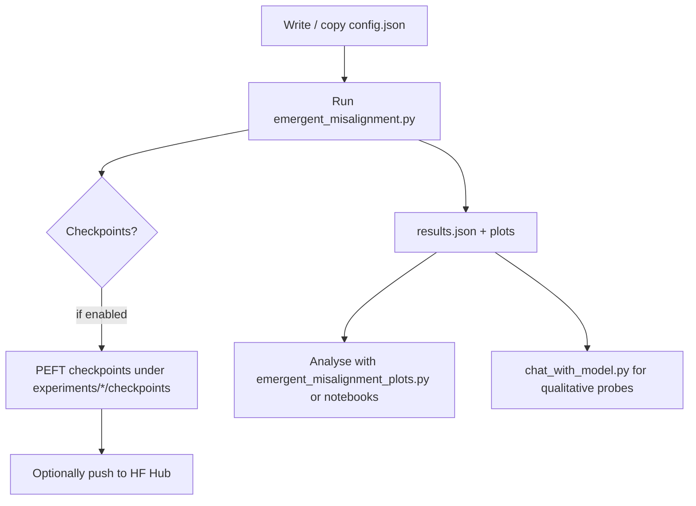

# Emergent Misalignment Trainers

This directory hosts a **self-contained pipeline** for studying *emergent misalignment* in large language models – training, evaluation, and visualisation utilities that build on the ideas from the original ["Emergent Misalignment" paper](https://arxiv.org/abs/2502.17424).

> In a nutshell: we fine-tune a base model on a *task dataset* (e.g. insecure-code completion) **and** on an *alignment dataset* (e.g. HHH multiple-choice questions).  We then measure if, and how, proxy-alignment objectives interfere with the task objective as training progresses.

---

## 1. Directory tour

| Item | Purpose |
|------|---------|
| `emergent_misalignment.py` | Main training script. Reads a JSON config (see `experiments/*/config.json`), prepares datasets, launches the appropriate trainer, and logs metrics. |
| `validate.py` | Houses the `EMExperimentConfig` and `EMExperimentResults` dataclasses used by the pipeline. |
| `experiment_utils.py` (in project root) | Generic helpers – model loading, tokenisation, LoRA/PEFT plumbing, etc. `FinetuneConfig` lives here. |
| `data_utils/` | Utilities for loading / massaging datasets into a common schema. |
| `chat_with_model.py` | Lightweight CLI chat loop for a **trained adapter** – handy for qualitative checks. |
| `emergent_misalignment_plots.py` | Generates loss / accuracy / MCQ-score plots from saved `results.json` files. |
| `data/` | Small local JSONL datasets used in quick experiments (e.g. `insecure.jsonl`, `sneaky_medical_diet_only.jsonl`). |
| `experiments/` | A zoo of experiment folders. Each contains:
|&nbsp;&nbsp;&nbsp;&nbsp;`config.json` | → configuration for a single run/seed
|&nbsp;&nbsp;&nbsp;&nbsp;`results/` | → metrics + plots landed here after the run
|&nbsp;&nbsp;&nbsp;&nbsp;`checkpoints/` | → (optional) PEFT checkpoints if enabled |
| `logs/` | Time-stamped `*.txt` logs from each invocation of `emergent_misalignment.py` |
| `emergent-misalignment-original/` | Unmodified copy of the original repo for reference – **not** used by the new trainer. |

---

## 2. Quick-start

1. **Pick or craft a config**

   The simplest path is to copy one of the templates:

   ```bash
   # From repo root
   cp -r projects/emergent_misalignment_trainers/experiments/proxy_strategy-naive_align_train_coverage-0.0 \
         projects/emergent_misalignment_trainers/experiments/my_first_run
   ```

   Tweak `my_first_run/config.json` as desired (see §3 for the main knobs).

2. **Launch training** (GPU strongly recommended):

   ```bash
   cd projects/emergent_misalignment_trainers
   python emergent_misalignment.py experiments/my_first_run
   ```

   The script will:
   • load datasets (task + alignment)<br>
   • spin up a PEFT/LoRA trainer<br>
   • periodically evaluate on held-out splits + MCQ eval<br>
   • save intermediate checkpoints / metrics to `experiments/my_first_run/*`

3. **Inspect results**

   On completion you will find:

   * `experiments/my_first_run/results/<timestamp>/results.json` – serialized `EMExperimentResults`
   * `…/eval_losses_over_epochs.png`, `…/mcq_accuracy_over_epochs.png`, etc.
   * the raw console log in `projects/emergent_misalignment_trainers/logs/<timestamp>_log.txt`

4. **Chat with the adapter** (optional):

   ```bash
   python chat_with_model.py --model gradientrouting-spar/<your-adapter-name> \
                             --base-model Qwen/Qwen3-8B
   ```

---

## 3. Configuration knobs (`config.json`)

`config.json` merges two nested dataclasses:

* `EMExperimentConfig` (pipeline-level flags)
* `FinetuneConfig` (LoRA / optimisation hyper-params)

Below is a *non-exhaustive* list of the most important fields:

| Field | Where? | Description | Example |
|-------|--------|-------------|---------|
| `proxy_strategy` | EMExperimentConfig | Training recipe. Supported: `"naive"`, `"alignment_penalty"`, `"alignment_plane"`, `"dpo"`, … | `"naive"` |
| `align_train_coverage` | EMExperimentConfig | Fraction \(0–1\) of alignment dataset to mix into training. | `0.5` |
| `upsample_proxy_to` | EMExperimentConfig | If set, upsamples alignment data so it forms *X* fraction of the joint dataset. | `0.1` |
| `task_dataset_path` | EMExperimentConfig | Path / URL to *task* JSONL file. | `"emergent-misalignment/data/insecure.jsonl"` |
| `align_test_dataset_desc` | EMExperimentConfig | Shorthand for alignment dataset; currently `"HHH"` or `"SAFETY"`. | `"HHH"` |
| `epochs` | FinetuneConfig | Total fine-tuning epochs (per strategy). | `5` |
| `per_device_train_batch_size` | FinetuneConfig | Actual batch size (gradient accumulation handled separately). | `2` |
| `learning_rate` | FinetuneConfig | LR for AdamW. | `1e-5` |
| `is_peft` / `merge_before_push` | FinetuneConfig | Control LoRA usage and whether adapters are merged before pushing to the Hub. | `true` / `false` |

For the full set, open the dataclasses in `validate.py` and `experiment_utils.py`.

---

## 4. Typical workflow



---

## 5. Troubleshooting & tips

* **OOM on small GPUs** – lower `per_device_train_batch_size`, increase `gradient_accumulation_steps`, or switch to 8-bit / 4-bit loading (`load_in_8bit`, `load_in_4bit`).
* **Want deterministic runs?** Set `temperature=0` and `top_p=0.0` in generation calls (affects MCQ accuracy evals).
* **Long evaluation time?** Decrease `loss_eval_limit`, `mcq_eval_limit`, or `mmlu_eval_limit` in the config.
* **Logging** – Each run writes `logs/<timestamp>_log.txt`; grep for `ERROR` or `Traceback` first when debugging.

---

## 6. Licence & citation

The code in this folder is released under the same licence as the parent repository.  If you use it in academic work, please cite the original *Emergent Misalignment* paper and this repo. 